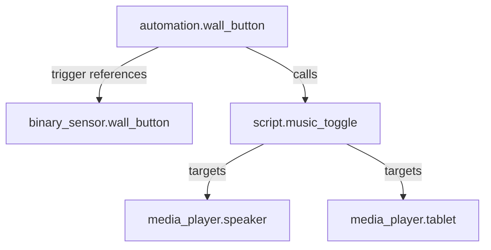
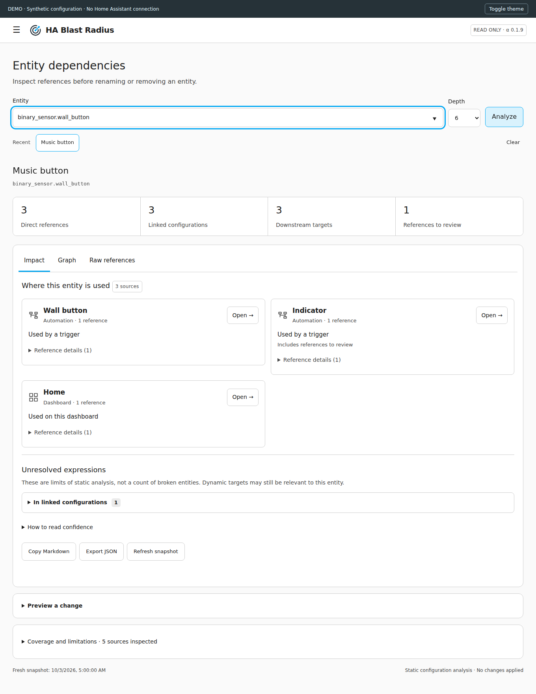

<picture>
  <source media="(prefers-color-scheme: dark)" srcset="docs/brand/dark-icon.svg">
  
</picture>

# HA Blast Radius

**Check dependencies before you make a change.**

Read-only dependency and impact analysis for Home Assistant. Find where an entity
is referenced, follow structural dependencies, and preview a rename or removal
before changing your configuration. Every result includes source paths and confidence.

**v0.1.9 · Experimental alpha · Admin only · MIT**

Requires Home Assistant **2026.9.4+**; tested against **2026.9.4**. Later releases
need compatibility testing. This is a static configuration inspector, not a runtime
simulator: an empty report does not guarantee that a change is safe.

[Install with HACS](#hacs-custom-repository) · [Usage](#usage) ·
[Known limitations](#known-limitations) ·
[Report a bug](https://github.com/artur-panek/ha-blast-radius/issues/new?template=bug.yml)



This synthetic example shows configuration references, not a guaranteed execution
sequence. Analyzing the button finds its dependent automation and the script's targets.



The screenshot uses synthetic fixtures, not a real household's configuration.
[Dark view](docs/panel-dark.png) · [Mobile view](docs/panel-mobile-dark.png)

## Features

- Exact reference paths in loaded automations and scripts.
- Recursive script calls, action targets, scene membership and exposed group membership.
- Configured Lovelace dashboards, including YAML, through HA's own loader.
- Jinja literals found without executing templates; unresolved expressions kept separate.
- Bounded dependency view with cycle detection and adjustable depth. Visible
  notices for incomplete results, with deeper inspection when a depth limit is reached.
- Clickable sources: inspect loaded automations/scripts in HA's read-only view,
  open scenes in their editor, dashboards in their view, and entities in details.
- Return to your last search, depth and tab after opening a source. Reopen any of
  six recent searches from a compact bar in the same browser tab.
- Rename/removal previews. **Neither operation is ever executed.**
- Markdown copy, JSON download, dark mode and mobile layout. No cloud or telemetry.

This goes beyond a flat “Related” list: each reference has a location, role and
confidence, and previews follow structural dependencies. It cannot tell you which
conditional branch will run tonight. That would be a different project.

## Installation

### HACS custom repository

1. In HACS, open **Custom repositories** from its menu.
2. Add `https://github.com/artur-panek/ha-blast-radius`, type **Integration**.
3. Download **HA Blast Radius**, then restart Home Assistant.
4. Open **Settings → Devices & services → Add integration → HA Blast Radius**.
5. Confirm setup. **Blast Radius** appears in the administrator sidebar.

This is a **custom repository**, not a HACS default-directory listing. All runtime files,
including the compiled frontend, are in `custom_components/blast_radius/`.
Users do not need Node.js or a frontend build.

### Manual

Copy `custom_components/blast_radius/` into your HA configuration directory's
`custom_components/` folder. Restart HA, then follow steps 4–5 above.
Uninstall through Devices & services first, then remove the integration files.

See [installation, updates and troubleshooting](docs/installation.md) for exact
paths, backups, rollback and common problems. No YAML configuration or credentials
are needed. A manifest version is not a GitHub release; see the repository's
[Releases page](https://github.com/artur-panek/ha-blast-radius/releases) for tagged builds.

New numbered versions are published after all Quality checks pass and are discoverable
through HACS update checks. Already installed from `main`? Use **Redownload** once
and select the latest numbered release. Updates do not install or restart HA automatically.

## Usage

1. Select or type an entity ID. Missing old IDs are accepted.
2. Choose a traversal depth and press **Analyze**.
3. Read **Impact**, **Graph**, or **Raw references**. Click a source name or **Open**
   to inspect it in Home Assistant; expand reference details for exact paths.
4. Expand **Preview a change**. Enter a same-domain replacement for **Preview rename**,
   or choose **Preview removal**. Expand coverage before drawing conclusions.
5. Copy/export the report. Make actual changes yourself in Home Assistant.

Every request takes a fresh snapshot. Registry-only entities, including disabled
entities, count as known even when they have no current state.

Returning to the panel or reloading it restores the last successful search and
fetches a fresh report. The **Recent** bar reopens a search at its previous depth;
**Clear** forgets the recent list and saved view. Browser session storage keeps
only entity IDs, depth, tab and scroll position, scoped to your HA user and tab.
Reports and configuration contents are not stored. Closing the tab normally ends
this history; browser session recovery may restore it.

## How analysis works

Graph edges point **from a configuration to the entity it references**. Impact
analysis first walks incoming references to find dependent configurations, then
follows their action targets, script calls and membership. It does not jump
upstream again from discovered action targets and invent runtime trigger chains.
Dashboards remain visible as dependent configurations, but traversal stops there:
actions on other cards do not become downstream effects of the selected entity.

Different locations remain separate references; identical references are deduplicated.
Nodes appear once and the edge list retains alternative paths. Default depth is 6,
adjustable from 1 to 12. Graphs cap at 500 nodes and 2,000 edges; scans cap at
50,000 references and 80 nested levels. Depth/size limits and specific snapshot
coverage gaps produce a **Results are incomplete** notice above the counts.
The notice offers a deeper search for depth-only limits below 12, and opens the
coverage details for skipped sources, unexpanded blueprint bodies and scan limits.
Warnings also appear in Markdown and JSON exports. The static-analysis limitations
below apply even when no warning is shown.

### Confidence model

| Classification | Example | Meaning |
| --- | --- | --- |
| Explicit | `entity_id: light.desk` | Recognized field or direct script call |
| Template literal | `{{ states('light.desk') }}` | Visible ID; execution is unknown |
| Dynamic | `{{ states('light.' ~ room) }}` | Final target cannot be resolved |
| Unclassified | Known ID in an untyped field | Candidate requiring manual review |

Dynamic references have **no guessed target**. Plain constant templates and common
value-only filters do not automatically count as unresolved dependencies. A templated
action or target remains unresolved even if it contains readable literal IDs: its
rendered destination is unknown. Simple template-local assignments and value loops
do not, by themselves, introduce unknown entity dependencies. Runtime variables,
unknown helpers/filters/tests, imports and state collections remain unresolved.

**Unresolved expressions** are grouped by source and reason, with two scopes:

- **In linked configurations:** affected automation/script configurations and
  dashboard cards with known reference links, including their parent/child cards.
- **Elsewhere in linked dashboards:** expressions outside those cards or at
  dashboard level. They remain visible and exported but are not attributed to the
  selected entity. Custom card boundaries cannot always be inferred.

The full-snapshot total remains under **Coverage and limitations**. These counts
describe expression locations, not broken entities. Even expressions in a linked
configuration may refer to something else. Zero references is not a guarantee that
removal is safe. The main summary counts known references and linked configurations.

The panel shows friendly names and readable, one-based locations such as
**View 2 › Card 3**. Expand **Reference details** or **Connection details** for exact
zero-based paths; the raw-reference view and exports retain the original identifiers and paths.

## Known limitations

- Loaded configurations only; invalid or unloaded YAML is not scanned.
- Blueprint inputs are inspected; blueprint bodies are not expanded.
- Scene/group membership is exposed; scene attribute strings are not scanned.
- Helper definitions and template integration definitions are not universally exposed.
- Device, area, floor and label selectors remain unresolved.
- Template literals are reference dependencies, not assumed downstream action targets.
- Generated/unavailable dashboards produce coverage warnings.
- Custom cards, JavaScript templates and unknown field semantics may be missed.
- No Node-RED, AppDaemon, ESPHome, runtime causality or event recording.
- Rename previews do not predict HA's own automatic reference rewrites.
- The adapter uses version-sensitive HA component interfaces. Tested against
  2026.9.4; later HA releases need compatibility testing despite the minimum-version declaration.

See [architecture and API](docs/architecture.md) for source access and
[validation](docs/validation.md) for tested versions and evidence.

## Architecture

| Layer | Responsibility |
| --- | --- |
| HA adapter | Read loaded configuration and copy bounded, normalized snapshots |
| Pure analysis engine | Extract references, classify uncertainty and traverse dependencies |
| Coordinator and WebSocket API | Serialize fresh snapshots and enforce administrator access |
| Lit sidebar panel | Inspect results, preview changes and export reports |

The pure engine has no HA imports. The adapter copies config on the event loop;
analysis runs in HA's executor. Jinja is parsed, never rendered. The API has
three read-only commands and no mutation service. Diagnostics contain version,
timestamp and aggregate counts, not source configuration. Exports do contain
entity IDs, names and structure: review them before sharing.

## Local development

HA tests require Python 3.14.2+. The pure engine also supports Python 3.12+.
The frontend requires Node.js 22.12+; CI uses Node 24.

```bash
python3.14 -m venv .venv
source .venv/bin/activate
python -m pip install -e '.[dev,ha]'
pytest -q --cov --timeout=60
ruff check .
ruff format --check .
mypy
python scripts/check_package.py

cd frontend
npm ci
npm run build
npx playwright install chromium
npm test
```

Engine-only: install `.[dev]` and run `pytest -q --cov --timeout=60`;
the HA integration tests are skipped when HA dependencies are unavailable.
For the interactive synthetic demo:

```bash
python scripts/generate_demo.py
cd frontend
npm ci
npm run dev
```

Open Vite's local URL. Demo reports come from the real engine; the mock transport
is excluded from the integration bundle. Rebuild and commit
`custom_components/blast_radius/frontend/blast-radius.js` after panel changes.
CI checks that the bundle matches the source. The browser suite regenerates
the synthetic screenshots in `docs/`; inspect their layout before committing.

## Contributing

See [CONTRIBUTING.md](CONTRIBUTING.md). Small synthetic fixtures beat full config
dumps. Security reports: [SECURITY.md](SECURITY.md). Preparing a release:
[release checklist](docs/releasing.md).

## Roadmap

- More helper and blueprint coverage through HA interfaces.
- Source filtering and richer graph navigation.
- Compatibility checks against future HA releases.

Automatic rewriting and runtime recording are outside this project's scope.
