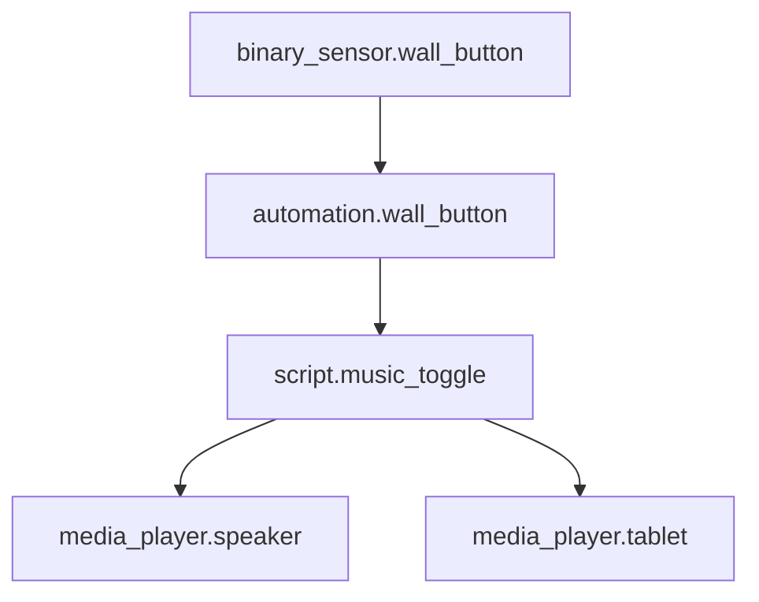
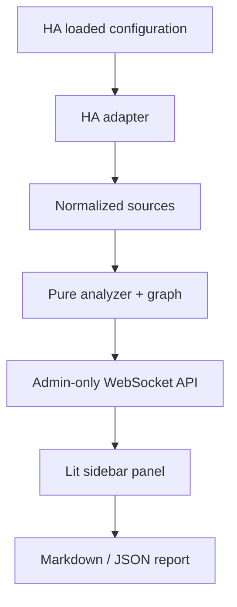

# HA Blast Radius

**Know what breaks before you touch it.**

Dependency and impact analysis for Home Assistant. A small, read-only answer to
“what else uses this entity?” — with paths, confidence levels and change previews.



Rename an entity? Retire a helper? Clean up that integration you stopped using?
Inspect its references before the lights mysteriously stop working.

**v0.1.1 · Experimental alpha · Home Assistant 2026.9.4+ · Admin only · MIT**


The screenshot uses synthetic fixtures, not a real household's configuration.
[Dark view](docs/panel-dark.png) · [Mobile view](docs/panel-mobile-dark.png)

## Features

- Exact reference paths in loaded automations and scripts.
- Recursive script calls, action targets, scene membership and exposed group membership.
- Configured Lovelace dashboards, including YAML, through HA's own loader.
- Jinja literals found without executing templates; unresolved expressions kept separate.
- Bounded dependency view with cycle detection and adjustable depth.
- Rename/removal previews. **Neither operation is ever executed.**
- Markdown copy, JSON download, dark mode and mobile layout. No cloud or telemetry.

This goes beyond a flat “Related” list: each reference has a location, role and
confidence, and previews follow structural dependencies. It cannot tell you which
conditional branch will run tonight. That would be a different project.

## Installation

### HACS custom repository

1. In HACS, open **Custom repositories** from its menu.
2. Add `https://github.com/artur-panek/ha-blast-radius`, type **Integration**.
3. Download **HA Blast Radius**, then restart Home Assistant.
4. Open **Settings → Devices & services → Add integration → HA Blast Radius**.
5. Confirm setup. **Blast Radius** appears in the administrator sidebar.

HACS default-list submission is out of scope for this alpha. All runtime files,
including the compiled frontend, are in `custom_components/blast_radius/`.
Users do not need Node.js or a frontend build.

### Manual

Copy `custom_components/blast_radius/` into your HA configuration directory's
`custom_components/` folder. Restart HA, then follow steps 4–5 above.
Uninstall through Devices & services first, then remove the integration files.

## Usage

1. Select or type an entity ID. Missing old IDs are accepted.
2. Choose a traversal depth and press **Analyze**.
3. Read **Impact**, **Graph**, or **Raw references**. Expand coverage before drawing conclusions.
4. Enter a same-domain replacement for **Preview rename**, or choose **Preview removal**.
5. Copy/export the report. Make actual changes yourself in Home Assistant.

Every request takes a fresh snapshot. Registry-only entities, including disabled
entities, count as known even when they have no current state.

## How analysis works

Graph edges point **from a configuration to the entity it references**. Impact
analysis first walks incoming references to find dependent configurations, then
follows their action targets, script calls and membership. It does not jump
upstream again from discovered action targets and invent runtime trigger chains.
Dashboards remain visible as dependent configurations, but traversal stops there:
actions on other cards do not become downstream effects of the selected entity.

Different locations remain separate references; identical references are deduplicated.
Nodes appear once and the edge list retains alternative paths. Default depth is 6,
adjustable from 1 to 12. Graphs cap at 500 nodes and 2,000 edges; scans cap at
50,000 references and 80 nested levels. Limits produce incompleteness warnings.

### Confidence model

| Classification | Example | Meaning |
| --- | --- | --- |
| Explicit | `entity_id: light.desk` | Recognized field or direct script call |
| Template literal | `{{ states('light.desk') }}` | Visible ID; execution is unknown |
| Dynamic | `{{ states('light.' ~ room) }}` | Final target cannot be resolved |
| Unclassified | Known ID in an untyped field | Candidate requiring manual review |

Dynamic references have **no guessed target**. The UI separates unresolved
references inside affected configurations from the count across the whole
snapshot. Zero references is not a guarantee that removal is safe.

## Known limitations

- Loaded configurations only; invalid or unloaded YAML is not scanned.
- Blueprint inputs are inspected; blueprint bodies are not expanded.
- Scene/group membership is exposed; scene attribute strings are not scanned.
- Helper definitions and template integration definitions are not universally exposed.
- Device, area, floor and label selectors remain unresolved.
- Template literals are reference dependencies, not assumed downstream action targets.
- Generated/unavailable dashboards produce coverage warnings.
- Custom cards, JavaScript templates and unknown field semantics may be missed.
- No Node-RED, AppDaemon, ESPHome, runtime causality or event recording.
- Rename previews do not predict HA's own automatic reference rewrites.
- The adapter uses version-sensitive HA component interfaces. Tested against
  2026.9.4; later HA releases need compatibility testing despite the minimum-version declaration.

See [architecture and API](docs/architecture.md) for exact source access and upstream links.

## Architecture



The pure engine has no HA imports. The adapter copies config on the event loop;
analysis runs in HA's executor. Jinja is parsed, never rendered. The API has
three read-only commands and no mutation service. Diagnostics contain counts only.

## Local development

HA tests require Python 3.14.2+. The pure engine also supports Python 3.12+.
The frontend requires Node.js 22.12+; CI uses Node 24.

```bash
python3.14 -m venv .venv
source .venv/bin/activate
python -m pip install -e '.[dev,ha]'
pytest -q --cov
ruff check .
ruff format --check .
mypy

cd frontend
npm ci
npm run build
npx playwright install chromium
npm test
```

Engine-only: install `.[dev]` and run `pytest tests/test_analysis.py --cov`.
For the interactive synthetic demo:

```bash
python scripts/generate_demo.py
cd frontend
npm ci
npm run dev
```

Open Vite's local URL. Demo reports come from the real engine; the mock transport
is excluded from the integration bundle. Rebuild and commit
`custom_components/blast_radius/frontend/blast-radius.js` after panel changes.
CI checks that the bundle matches the source.

## Contributing

See [CONTRIBUTING.md](CONTRIBUTING.md). Small synthetic fixtures beat full config
dumps. Security reports: [SECURITY.md](SECURITY.md).

## Roadmap

- More helper and blueprint coverage through HA interfaces.
- Source filtering, editor deep links and richer graph navigation.
- Compatibility checks against future HA releases.

Automatic rewriting is not planned. Historical recording belongs to the
separate **HA Black Box** idea.
